# Fitness Master


# Fitness Master

Fitness master is a website with a target audience of people who love going to the gym and need to track their activity and be able to see their training progress. They need a place to store their exercise data, explore different exercises or be able to create their own.


## Contents
<p align="center">
  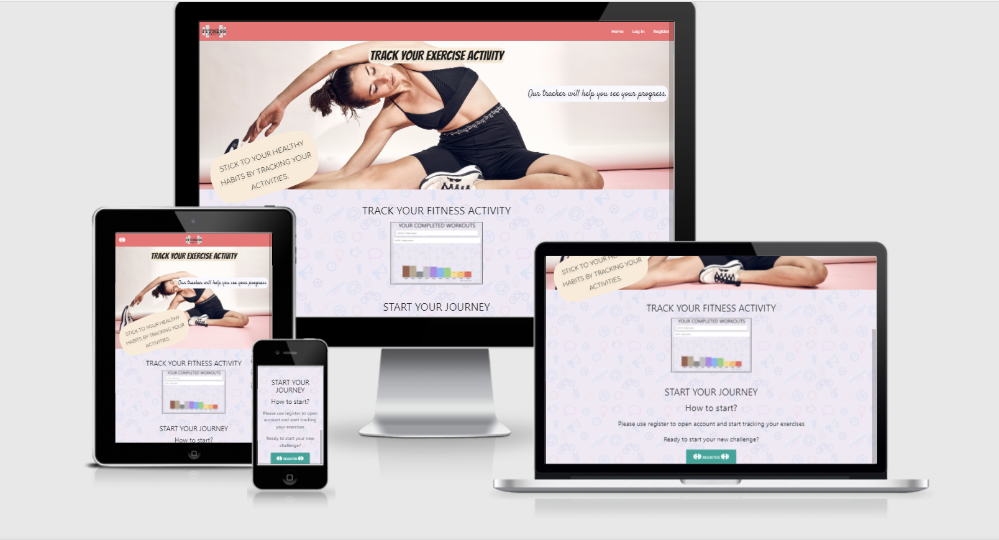
</p>
 
<p align="center"><a href= 'http://milestone3.ddnsfree.com:8014/ target = "_blank">Fitness Master</a></p>
 
## Table of Contents
 
- [About](#About)
- [User Experience (UX)](#User-Experience-(ux))
  - [User Stories](#User-Stories)
  - [UI](#ui)
  - [Design](#Design)
  - [Database Schema](#database-schema)
  - [Database Model](#database-model)
  - [Wireframes](#Wireframes)
- [Features](#Features)
    - [Future features](#Future-updates)
- [Technologies used](#Technologies-used)
- [Testing](#Testing)
    - [Manual testing](#Testing)
- [Errors](#Errors)
- [Code Notes](#Code-Notes)
- [Deployment](#Deployment)
- [Credits](#Deployment)
    - [Code](#Code)
     - [Images](#Images)
- [Acknowledgements](#Acknowledgements)

---
## About

The purpose of this project was to build a website where users can tailor their exercise routines to suit their needs and keep record of their achievements.

---

## User Experience (UX)

### User Stories

#### As a first time user I want to:

  * Have a selection of exercises to choose from when I want to change my exercises or find new ones
  * Be able to read about each individual exercise in detail specifically how to do it and which area of the body it targets
  * Be able to add my own exercises or modify existing ones to suit my training needs
  * Be able to track my workout session by monitoring number of reps, sets and weight
  * Be able to save my progress before the next training session

#### As a returning user I want to:

  * Be able to log into my account
  * Be able to review my saved sessions and see my progress
  * Be able to see my workout history(by Names) in my profile
  * Be able to see my workout history in detail (through expandable details)
  * Be able to have graphs of the progress on weight for each exercise
  * Be able to view statistics for the last 5 sessions for each exercise within workout
  * Be able to hide SYSTEM exercises and use only exercises added by me 

#### As an owner of the website I want to:
  * Ensure my first-time users are able to find an easy way to "Register" and set up their first exercise workouts
  * Provide my returning users the ability to log in and view access their saved workouts and saved training progress
  * Users should be able to edit their existing workouts by adding new exercises to them
  * Users need to be able to find new exercises to try using the database with the information on how to do the exercise and which body party it targets
  * Users should also be able to add their own exercise and add it to their saved workout
  * Users should be able to create one or multiple workouts to keep their training diverse
  * My Account page should give showed the users they past sessions and visualize their progress in weight through a graph
  * Users to have the ability to view statistics for the last 5 sessions for each exercise within workout
  * Users to have the ability to hide SYSTEM exercises and use only Users-added exercises


### UI

  * A responsive and top attached Navbar
  * A form to add individual exercise
  * A form to add individual workout
  * A search function for users to find exercises based on a keyword input 
  * A form to modify an exercise
  * A form to modify a workout
  * Graphs to display user progress populated using saved previously completed exercise
  * A registration/login form for the first time and returning users
  * A loading page was implemented to stop poor impressions from data loading slowly
  * A footer to provide some information and social links

### Design

  * The design of the website  is minimalistic but eye catching using sport themed [background.](static/img/tile_background_tile.png)
  * Main page has a nice image background as well as displaying an example of the fitness activity snapshot from user profile to catch attention of the new visitors.
  * At the bottom of the page Register button displayed for the new users or "Profile" button for the logged-in users.
  * Links and buttons have a hover effect.
  * Exercise/workout containers have a shadow to stand out from the page.


### Wireframes
WWireframes are my initial design, so you may notice that the final website design does not contain everything that was planned at the start of the project. Some missing features are possible future improvements for the project. They may be implemented at a later stage.
  * [wireframes.pdf](readme_screenshots/wireframes.pdf)

### Database Schema

I started planning the database after I have done my wireframes to justify which fields I would require and what collections I would have to use. After the initial discussion with my mentor, I have settled with the current database schema.
 * [Database schema](readme_screenshots/database_structure.pdf)

### Database Model

  * [Database model](readme_screenshots/database_diagram.png)


#### CRUD

HTTP Verb | URL PATH | PURPOSE
| --- | --- | --- |
GET | /workout | List All workouts
POST | /workout/create | Create workout
POST | /workout/edit/<:id> | Update workout
DELETE | /workout/delete/<:id> | Delete workout
GET | /workout/start/<:id> | Start Workout
POST | /workout/start/update/:data | Update exercise data inside workout 
GET | /exercise | List All exercises
POST | /exercise/create | Create exercise
GET | /exercise/<:id> | Show individual exercise
POST | /exercise/edit/<:id> | Update exercise
DELETE | /exercise/delete/<:id> | Delete exercise
POST | /register | Register new user
GET | /login | Login user
GET |  /profile/ | User profile
GET | /logout | Logout user


---

## Features

* Ability to Signup/login.
  * ```For user to be able track their exercises```
* Ability to add an exercise.
  * ```User should be able to create their  own custom exercises```
* Ability to edit exercise.
  * ```User should be able to edit their own custom exercises or copy and modify system exercises```
* Ability to delete exercise.
  * ```User should be able to delete their own custom exercises```
* Ability to show/hide system exercises
  * ```User should be able to hide system exercises if user wish to see only the one created by them self```
* When modifying system exercise, that exercise gets cloned and derived from original.
  * ```This feature ensures user are unable to change data on the system exercise, instead it gets copyied to the user account```
* User unable to delete system exercises
  * ```Safety feature to prevent user accidentaly remove system exercise```
* Ability to edd a workout.
  * ```User should be able to create their own custom workouts```
* Ability to edit workout.
  * ```User should be able to modify their own custom workouts```
* Ability to delete workout.
  * ```User should be able to delete their own custom workouts```
* A loading page.
  * ```In case of slow internet connection user will see loading bar showing  that data id still loading```
* Ability to save current workout session statistics for individual exercise within that workout.
  * ```To track users exercises reps/weight user can save their session withing each workout for individual exercise```
* Ability to view statistics for the last 5 sessions for each exercise within workout.
  * ```Each exercise within workout display history of user previous session limited to the last 5 records to keep within minimalistic design```
* A fully functioning search for exercises based on either exercise name or description text(word/phrase).
  * ```Users are able to find exercise of their interest by performing search which looks for any word within header or desription of exercise```
* Ability to view historical weight progress for each exercise.
  * ```Users are prsented with chart to help them track their workouts weight```
* The project contains a few security features, such as:
  * validating login.
    * ```Username is checked for dublicates and ensures that no same accounts are created. User will be notified if username is exists in the database.```
  * hashing passwords.
    * ```To provide extra security measures all password are encrypted before they are stored in the database```
  * environment variables are hidden.
    * ```All vital informaiton for the server to function is hidden```
  * debug is turned off in the production version.
    * ```To ensure no server errors are visible to the user. Debug is turned off and user will get 4xx or 5xx page.```


###  Future updates

1. Rework login logic to use id as identifier instead of username. This would help in case user decide to change username but keep all the records.
2. Create change/update password for user.
3. Display calendar in the profile to show on which  day workout was completed.


---
 
## Technologies used

Below I have listed the programming languages, technologies, frameworks and resources used for this project.
 
* **HTML5**
* **CSS3**
* **Vanilla JS**
* **J Query**
* **Markdown**
* **Git** for version control.
* **Github** to hold my project.
* **Heroku** to deploy my project to the web.
* **Flask**
* **MongoDB**
* **Google Chrome/FireFox/Edge/Safari** 
* **Developer tools for chrome/FireFox/Edge**
* **[Amiresponsive](http://ami.responsivedesign.is/)**
* **[Balsamiq](https://balsamiq.com/)** to create wireframes.
* **[W3Schools](https://www.w3schools.com/)** for help with some issues I ran into
* **[StackOverFlow](https://stackoverflow.com/)** for help with some issues I ran into
* **Mentor** my code institute mentor for advice
* **[Slack](https://slack.com/)** specifically the code institute room in slack.
* **[Grammarly](https://www.grammarly.com/)** to correct grammar and spelling mistakes.
* **[Charts CSS](https://chartscss.org/)** to display charts for each workout completed
* **[animate.style](https://animate.style/)** to display animations

---

## Testing

* [HTML validator](https://validator.w3.org/#validate_by_input)
  * [No issues](readme_screenshots/html_validator.png)
* [CSS validator](https://jigsaw.w3.org/css-validator/#validate_by_input)
  * [CSS validator showing lots of ```is an unknown vendor extension``` in vendors css files.](readme_screenshots/css_validator.png)
  * In my own styles.css I only get info ```Due to their dynamic nature, CSS variables are currently not statically checked```
  
* [JsHint](https://jshint.com)
  * [Warning](readme_screenshots/js_validator.png) ```eval can be harmful.``` (all_exercises.js, workouts.js) I have to use eval here to get True boolean value for the checkbox. 

* Testing [checklist](https://geteasyqa.com/qa/test-website/)
* [pep8](http://pep8online.com/)
  * [No issues](readme_screenshots/pep8.png)
 
I personally tested the website on some of my own personal systems of which include:
1. Windows10 Google Chrome, Mozilla, Edge browsers
2. [https://www.webpagetest.org/](https://www.webpagetest.org/) To test for errors and performance 
   1. [Results](https://www.webpagetest.org/result/211009_AiDc5N_a4c6e1f8dd76b710619eb03b3da95216/)
      * Score ```F``` for Security score has to be setup on the server side of heroku
      * Score ```D``` for Compress Transfer has to be setup on the server side of heroku
      * All other score looks good


### Manual testing

I opened the live site in the browser and clicked links as appropriate and input data where necessary.  I also tried to check inputs by entering incorrect information or missing any altogether to ensure logic flows correctly.
I also tried to access pages where user login required by entering corresponding url into navigation bar, to ensure users get redirected either back to the home page or 404 page.

General navigation testing
1. Upon landing onto main page, navigate to register page and create new account.
2. Once account created page will redirect you onto main page. From here navigate to individual exercises page.
3. Page will show system exercises from here you can create your own, or you can copy and modify system exercises.
4. You can open each individual exercise to read more about it.
5. Navigate to workouts page to create you personalized routine.
6. Create new workout, enter your workout name, and select exercises you wish to use in this workout then press create workout button.
7. After creating workout press on newly created workout tab this will take you to the start workout page
8. While you progressing with each exercise in the workout you need to add each set to session using '+' button.
9. Once you complete session for first exercise you need to complete exercise session to store you records.
10. Then you can progress onto next exercise.
11. Once you complete all exercises in the workout you need to press finish workout.
12. After finishing workout you will be redirected to the workouts page where you can choose to display on not completed workouts.
13. Navigate back to the profile page
14. If you used any "equipment" which required to use weights, this weight which you save during the workout will be displayed in the charts.
15. If you didn't use any weights and recorded your session with weight "0" you may see an empty chart.
16. If you wish to delete any of yours exercises you can do that in the edit tab.
17. Navigate to the exercise you wish to delete, open it, the click on EDIT icon.
18. At the bottom of the page you will find delete button.
19. If you wish to delete workout.
20. Navigate to the workouts page.
21. Find workout you wish to remove and press on the EDIT icon.
22. From edit page you will find DELETE button.

---
<details>
<summary>
Detail testing
</summary>

N | Section | Test | Result
|:---:|---|---|:---:|
1 | User account | Create an account, works as it should, passwords are hashed for security. |  &#9745;
2 | User account | Logging in to the created account. | &#9745;
3 | User account | Logout functionality. | &#9745;
4 | Exercises | Adding new exercise, works as it should. Adding new exercise possible to only logged-in user  |  &#9745;
5 | Exercises | * System and user exercises are displayed.<br> * Turning off "Show system exercises" hides all non user records. <br>    *  State of the switch preserved if the page get reloaded  |  &#9745;
6 | Exercises |  Search for full exercise name or a full word within the description working as it should. <br>   *(Partial text is not functioning at the moment example: full word "food", searching for "foo" would not show any result) |  &#9745;
7 | Exercises | Clicking on exercise card will take to exercise detailed info |  &#9745;
8 | Exercises/edit |  Clicking "EDIT" link within detailed exercise info page will take user to the form page where user can update any field |  &#9745;
9 | Exercises/edit | Update any fields within EDIT exercise page press "UPDATE EXERCISE" button: <br> - results gets updated <br> - Flash message displayed  |  &#9745;
10 | Exercises/delete | Delete exercise from database |  &#9745;
11 | Workouts | Create new workout functionality |  &#9745;
12 | Workouts/create | Pick exercises are displaying user and system exercises |  &#9745;
13 | Workouts | Click on newly created workout card, takes you to "Start workout" page  |  &#9745;
14 | Workouts/start | All selected workouts are displayed |  &#9745;
15 | Workouts/start |  On any exercise card dial "reps" and "weight" then press to "add to session" button <br> 1. "current session" will display newly added line <br> 2. Repeat previous step to add few more <br> 3. Press "complete exercise" to save progress <br> 4. Newly saved progress would be displayed on the "Last 5 set" section |  &#9745;
16 | Workouts/start | Press "save workout" button this will save current workout. Then de-select "show completed" switch. Should hide all workouts that marked as completed. | &#9745;
17 | Workouts/delete | Delete selected workout |  &#9745;
18 | Profile | Displaying username  |  &#9745;
19 | Profile | Displaying latest workout weights progress  |  &#9745;

 
No automated testing was conducted.
</details>

---

<details>
<summary>
User stories testing
</summary>

N | Section | Test | Result
|:---:|---|:---:|:---:|
1 | Create personalized workout routines | 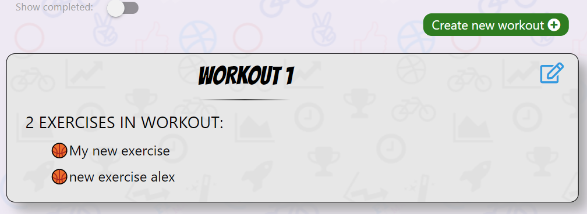 |   &#9745;
2 | Have selection exercises to choose from | 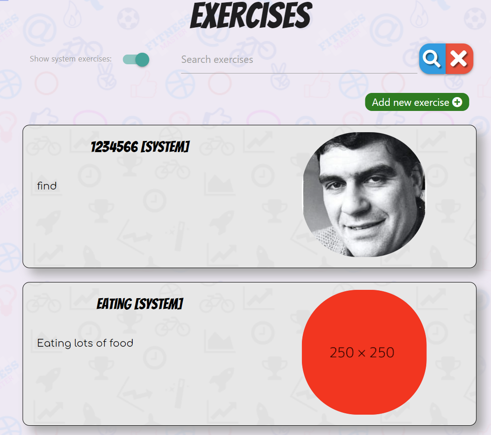 |   &#9745;
3 | Be able to read about each individual exercise in details, how to do it, and which area of the body it targets | 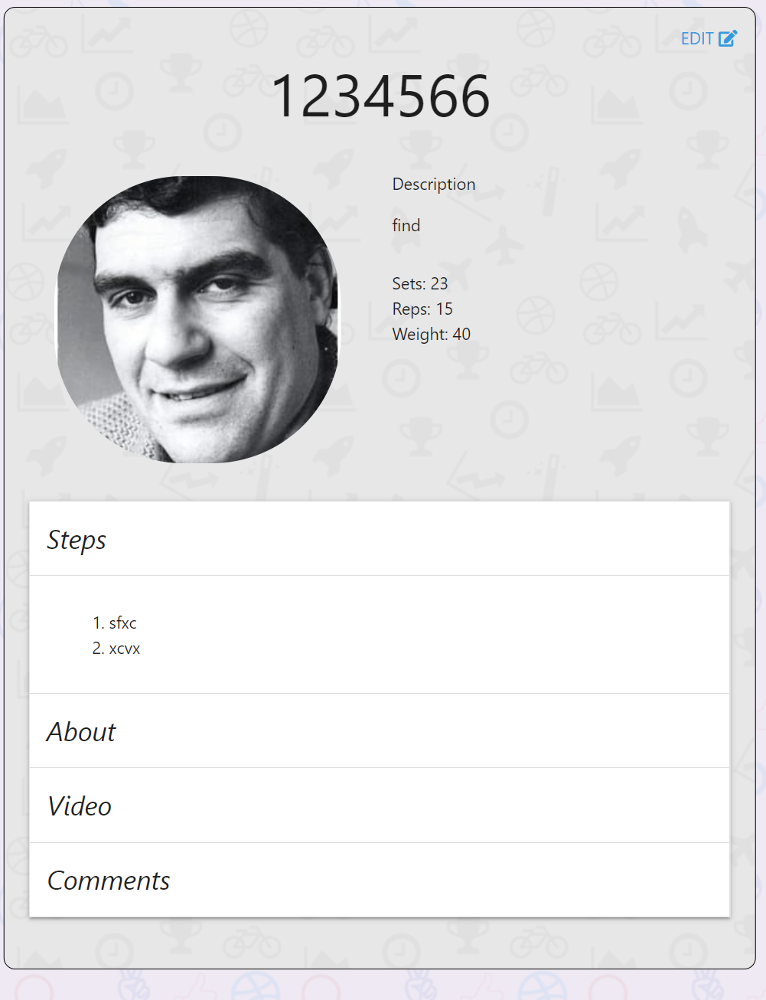 |   &#9745;
4 | Be able to add my own exercises or modify existing ones to suit my needs | 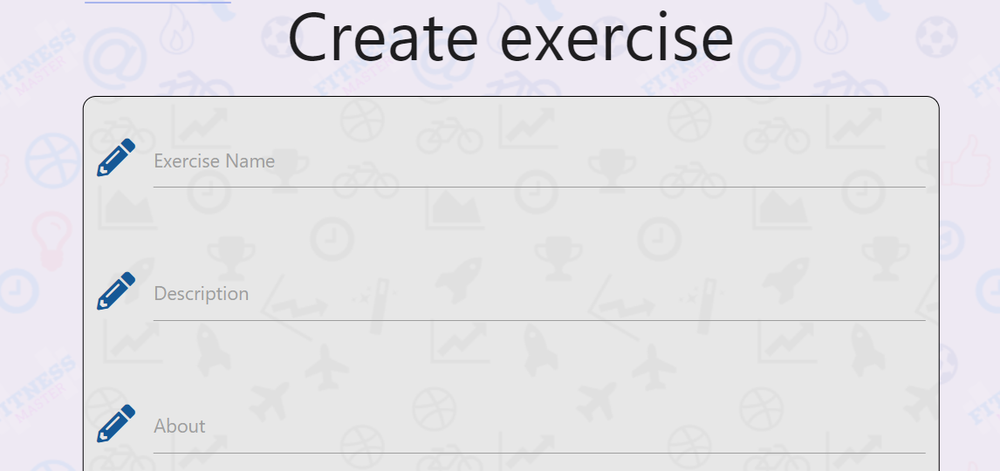 |   &#9745;
5 | Be able to track my workout by monitoring amounts of reps, sets and weight | 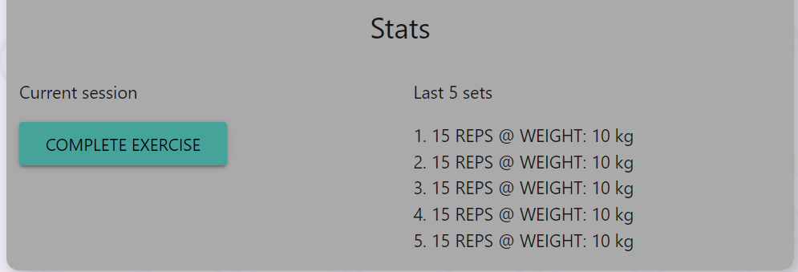 |   &#9745;
6 | Be able to save my progress   | 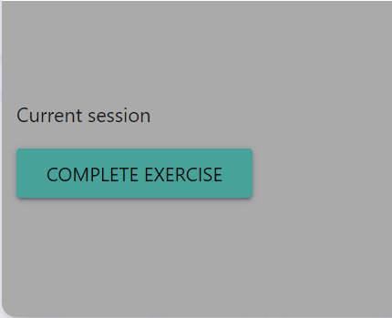 |   &#9745;
7 | Be able to review my progress  | 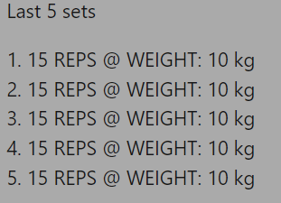 |   &#9745;
8 | Be able to see my workout history(Names) in my profile  | 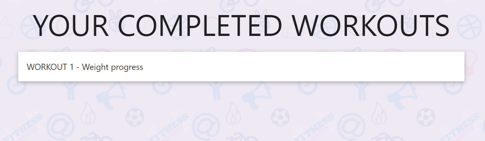 |   &#9745;
9 | Be able to see my workout history in details (Expandable details)  | 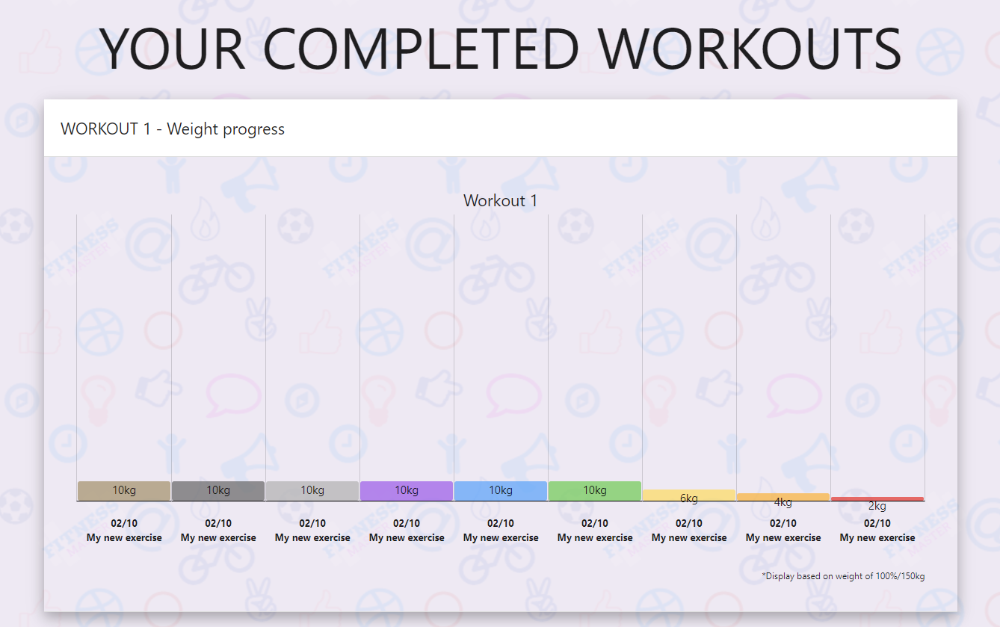 |   &#9745;
10 | Be able to see graphs of progress on weight on each exercise   | 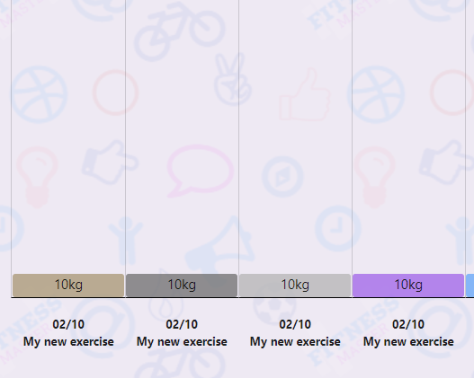 |   &#9745;

</details>

---

### Errors
<details>
<summary>
Current errors:
</summary>

1. When deleting exercise, its name still shown in the workout card, until this card get modified by user and new exercises are reselected.
    * Left as it is at the moment.
    * Possible fix, query db when deleting exercises, and remove record from workout list containing that exercise.
    * Better solution to use relational DB in the future.
    
2. I was trying to create mongoDB query filter where I have system created exercises and user able to modify system exercise by cloning it. As a result I have system and user modified with the similar/same name, and both are displayed to user. I was unable to create filter which will hide system exercises once they are cloned by user. After spending hours in search for solution I decided to go in different approach.

   * Now user still able to clone system exercises, and they are both displayed to user(even if they have same name), but *```I gave user an option to hide all system exercises on the HTML page via selector switch.```*

3. Found inconsistency in records inside Exercise collection where field "origin" has not been populated, or created. Cannot reproduce this issue on my environment, as a precaution I created validation.
   * in Edit exercise function I added ```"origin": single_exercise["origin"] if single_exercise['origin'] else session["user"]``` If "origin" field is empty for some reason this would fill it with username from session
   * **Fixed** Added missing 2 field from update workout data function while updating exercise records.

4. Peer review found bug where when creating new exercise user was unable to click on the "about" field
   * **Fixed**  ```<label for="about">About</label>``` was assigned to the wrong field.

5. On the workouts page I wanted to display message if no workouts exists in database. Due to the data returned to the template (All workouts for the user + non user workouts) I unable to validate it if no records exists for current user.
   1. Can be done with JS display/hide message
   2. In the future updates it is possible to filter data using mongo aggregate functionality before sending over to the template. I need to study more MongoDB functionality to effectively implement it.
</details>

---

## Code Notes
* In base.html I had to put script inside  statement because I would only need to load this script when this section gets rendered on the webpage, otherwise I was getting error ```Cannot set property 'innerHTML' of null```

---

## Deployment

<details>
<summary>
Deployment
</summary>

To deploy this project I used [Heroku](https://dashboard.heroku.com/)

**The final version of the application was deployed using Heroku:**   
**[here](https://fitness-master.herokuapp.com/)**

The deployed version is the same version as in the repository.

The following steps were used for deployment on Heroku:

1. In Gitpod CLI, in the root directory of the project, run 

   `pip3 freeze --local > requirements txt`

   to create a `requirements.txt` file containing project dependencies.

2. In the Gitpod project workspace root directory, create a new file called Procfile, with capital 'P'.  
   Open the Procfile. Inside the file, enter:  

   `web: python3 app.py`

    Save the file.

3. **Make sure you do a Git commit after creating the requirements.txt and the Procfile.**

4. On [Heroku](https://www.heroku.com/), sign in using your username and password.

5. On Heroku Dashboard, press the "New" button, then select "Create new app".

6. Enter the name of your app and select your region.   
   Press "Create app".

7. On Heroku App Dashboard, select the Settings tab.

    Under "App information", copy the Heroku git URL.

8. In Gitpod workspace CLI, in the project's root directory, enter  

    `heroku login`   

    Follow the instructions to login.

    Enter 

    `git remote add heroku <Heroku Git URL>`

    where `<Heroku Git URL>` is the Heroku git URL copied from the Heroku App Dashboard in Settings (step 7 above).

    Finally, enter

    `git push heroku master`

    to push the contents of your local Git repository to the newly created Heroku remote repository.

9. Still in the Gitpod workspace CLI, enter 

     `heroku ps:scale web=1`
        
     to start the Heroku web process.

10. Log into your [MongoDB Atlas](https://account.mongodb.com/account/login) account.   

    In the dashboard, select your database Cluster, then click the Connect button.

    In the pop-up, select the option "Connect your application". 

    Under the tab "Connection string only", copy the connection string.

11. Login into [Cloudinary](https://cloudinary.com/) account.
    
    In the dashboard copy your cloud name, API key and API Secret

12. On Heroku App Dashboard, in the Settings tab, click the button "Reveal Config vars".

    Using the Add button, add the following keys and their corresponding values:

    key: `IP`  
    value: `0.0.0.0`

    key: `PORT`   
    value: `5000`   
    
    key: `MONGO_URI`   
    value:   
    - paste the string copied from MongoDB,
    - inside the pasted string, replace `<password>` with your database access password (**NOT** your MongoDB login password),
      ensure you remove the `<>`.
    - replace `test` with the name (case-sensitive!) of the database used for your project.

    key: `SECRET_KEY`   
    value: value of SECRET_KEY as entered into the project's env.py file, **without quotes** . 

13. Whilst in the "Config vars" section add the rest of the required [Cloudinary](https://cloudinary.com/) requirements.
    
    key:cloud_name
    value: <your cloud name>

    key: api_key
    value:  "<api value>"

    key: api_secret
    value:  "<secret value>"

14. In the top right corner of the Heroku App Dashboard, click on the More button.

    From the dropdown menu, select "Restart all dynos". Confirm Restart when prompted. 

15. Click on Open app. The App is now deployed.
</details>

### Local Deployment
<details>
<summary>
If you want to run this project locally, you will need to follow these steps.
</summary>

1. Clone or download this repository.

2. Upload the repository into your IDE of choice.  

I used Gitpod for development, so the following steps will be specific to Gitpod. You will need to adjust them depending on your IDE.

3. In your workspace CLI, run

   `pip3 install -r requirements.txt`

   to install the project-required dependencies.

4. In the root directory of your project, create an env.py file. 

   Don't forget to add the env.py file to your .gitignore file.

5. In MongoDB Atlas, create a new database for the project.

    The database needs to have the following attributes:

    - collection "categories"
    - collection "exercises"
    - collection "routines"
    - collection "user_profile"
    - collection "users"
   
    In collection "categories":
    - document property: "category_name" -> String
    - document property: "img" -> String

    In collection "exercises":
    - document property: "about" -> String
    - document property: "created_by" -> String
    - document property: "exercise_comments" -> String
    - document property: "exercise_name" -> String
    - document property: "exercise_reps" -> String
    - document property: "img_url" -> String
    - document property: "is_system" -> Boolean
    - document property: "modified_date" -> String
    - document property: "steps" -> Array
    - document property: "weight" -> String
    - document property: "yt_url" -> String
    - document property: "exercise_sets" -> String
    - document property: "exercise_category" -> List
    - document property: "origin" -> String
    - document property: "exercise_history" -> List

    In collection "routines":
    - document property: "completed" -> Boolean
    - document property: "created_date" -> String
    - document property: "exercise_choices" -> Array 
    - document property: "modified_date" -> String
    - document property: "saved" -> Boolean
    - document property: "weight" -> String
    - document property: "workout_name" -> String
    - document property: "workout_reps" -> String
    - document property: "created_by" -> String
    - document property: "workout_sets" -> String

    In collection "user_profile":
    - document property: "comment" -> String
    - document property: "date" -> String
    - document property: "exercise_id" -> String
    - document property: "exercise_name" -> String
    - document property: "reps" -> String
    - document property: "username" -> String
    - document property: "weight" -> String
    - document property: "workout_name" -> String
    - document property: "workout_id" -> String

6. Once you have created the database, go back to the Cluster View and click "Connect".
    In the resulting pop-up, click on "Connect your application".
    Under the tab "Connection String Only", copy the connection string.

7. Back in your IDE, open the env.py file.

   At the top of the file, add 

   `import os`

   Then, add 

   `os.environ["MONGO_URI"] = "<mongo_uri>"`
    
    where `<mongo_uri>` is the pasted MongoDB connection string copied in step 6 above.

   In the pasted `<mongo_uri>` string:
   - replace < password > with your database access password (**NOT** your MongoDB login password), and
   - replace "test" with the name (case-sensitive!) of your project database. 

   Finally, add

   `os.environ["SECRET_KEY"] = "<your_secret_key>"`

    where `<your_secret_key>` is a combination of letters, numbers and characters of your choice. This is used to enable the Flask flash messaging feature.

    

8. Login into [Cloudinary](https://cloudinary.com/) account.
    
    In the dashboard copy your cloud name, API key and API Secret
    
    Add them to your env.py
   1. `os.environ["cloud_name"] = "<your_cloud_name>"`
   2. `os.environ["api_key"] = "<your_api_key>"`
   3. `os.environ["api_secret"] = "<your_api_secret>"`
   
    Save the file.

9. Run the app.py file and open it in your browser.   
    The application is now running locally.
</details>


---

## Credits
### Code

   * Animations are done with help of [animate.style](https://animate.style/)
   * Website built based on [MaterializeCSS](https://materializecss.com/)    
   * YouTube for videos used in exercises

### Images
* [https://cloudinary.com/](https://cloudinary.com/)
* [Google-Images](https://www.google.com/imghp?hl=en)
* [https://unsplash.com/](https://unsplash.com/)
* User uploaded images are credits to their source and be used as is. As a website owner I don't take any responsibility for user provided content. (If any images found in breach of the copyrights please contact me.)
* [image placeholders](https://placehold.it/250x250)

---


## Acknowledgements
 
* A thank you to my friends and family for testing the website for me.
* Thank you to my mentor for the help and support.
* [Aidan](https://github.com/aidant842/MilestoneProject3) for this README template
* A big thank you to my teammates on slack, for their enormous help and support if any issue arise.

[Back to top ↑](#fitness-master)


